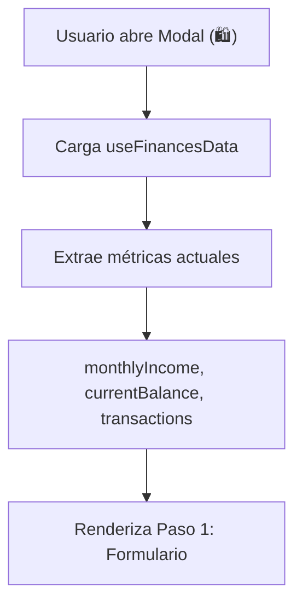
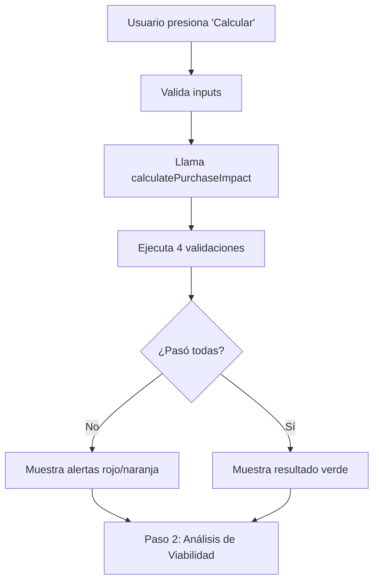
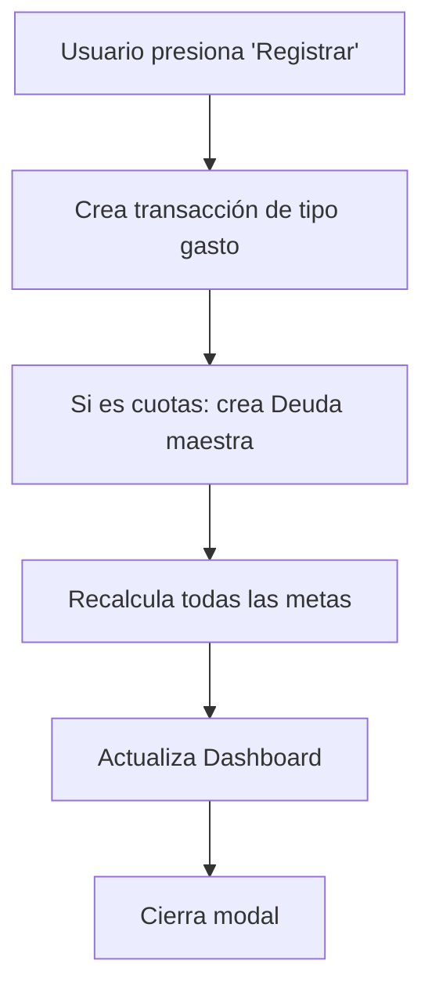

# 📊 Especificación Técnica: Asistente de Salud Financiera Preventiva

**Versión**: 1.0.0  
**Fecha**: 5 de enero de 2026  
**Estado**: Implementación en Fase 1  
**Stack**: React 19.1.0 + Vite 7.3 + Tailwind CSS 3.4.0 + Recharts 2.10.3

---

## 1. Visión General

El **Asistente de Salud Financiera Preventiva** es un sistema de toma de decisiones financieras integrado en la aplicación de finanzas personales. Proporciona al usuario dominicano herramientas de precálculo y análisis antes de realizar compras, evitando sobreendeudamiento y promoviendo decisiones financieras conscientes.

### Objetivos Principales:
1. ✅ Prevenir endeudamiento excesivo (límite 30% de ingreso mensual)
2. ✅ Proteger fondo de emergencia (mínimo 6 meses)
3. ✅ Acelerar cumplimiento de metas mediante sacrificios inteligentes
4. ✅ Transparencia total en costos de oportunidad
5. ✅ Educación financiera continua

---

## 2. Componentes Implementados

### 2.1 Hook: `usePurchaseAssistant.js`

**Propósito**: Lógica central del precálculo de compras

**Funciones principales**:

```javascript
calculatePurchaseImpact(
  purchaseAmount,
  monthlyIncome,
  currentBalance,
  currentDebtPayments,
  fixedExpenses,
  sacredGoalPayments,
  months,
  debtType = 'sin-interes',
  emergencyFundMonths = 6,
  averageFixedExpenses = 0
)
```

**Retorna**:
```javascript
{
  purchaseAmount: number,
  monthlyPayment: string (formato decimal),
  debtRatio: string (porcentaje),
  emergencyFundMonthsBefore: string,
  emergencyFundMonthsAfter: string,
  balanceAfterPurchase: number,
  totalInterest: string,
  alerts: Array<{ type, message, code }>,
  isFeasible: boolean,
  criticalityLevel: 0|1|2|3 // 0=OK, 1=Yellow, 2=Orange, 3=Red
}
```

**Algoritmo de Validación** (4 pasos):
1. **Fondos Básicos**: Balance ≥ Costo → STOP si NO
2. **Fondo Emergencia**: Balance post-compra ≥ 6 meses gastos fijos → YELLOW si NO
3. **Ratio Endeudamiento**: (Cuotas / Ingreso Base) ≤ 30% → ORANGE si NO
4. **Liquidez Crítica**: Balance post-compra > 0 → RED si NO

### 2.2 Componente: `PurchaseAssistantModal.jsx`

**Propósito**: Interfaz principal del asistente de compras

**Estructura**: Modal con 3 pasos

#### Paso 1: Formulario de Compra
```
Inputs:
  - Nombre del producto (texto)
  - Monto total (número)
  - Categoría (select)
  - Método de pago (efectivo/cuotas)
  - Tipo de deuda (si es cuotas)
  - Plazo (rango 3-60 meses)
```

#### Paso 2: Análisis de Viabilidad
```
Muestra:
  - Cuota mensual calculada
  - Plazo en meses
  - Balance disponible post-compra
  - Ratio de deuda
  - Meses de fondo emergencia
  - Costo en intereses (si aplica)
  - Alertas (rojo, naranja, amarillo)
  - Botones: Volver, Ver Opciones, Registrar
```

#### Paso 3: Plan de Acción
```
Muestra:
  - Sugerencias de sacrificio
  - Opción de aceptar y crear plan
  - Botones: Aceptar, Volver
```

### 2.3 Componente: `HormigaPatternDetector.jsx`

**Propósito**: Detectar patrones de gastos repetitivos pequeños

**Lógica**:
- Analiza últimas 30 transacciones de tipo `gasto-variable`
- Busca gastos < RD$ 500 que se repitan 3+ veces
- Muestra notificación emergente con opción de aceptar
- Calcula ahorro potencial si reduce a la mitad

**Props**:
```javascript
{
  transactions: Array<Transaction>,
  onPatternDetected: Function,
  threshold: 500,           // Monto máximo para hormiga
  minOccurrences: 3,        // Veces mínimas para detectar
  darkMode: boolean
}
```

### 2.4 Componente: `SavedAhorroButton.jsx`

**Propósito**: Registro de "Ahorro Confirmado"

**Ubicaciones disponibles**:
- Botón flotante 💰 (z-index 35, no interfiere con FAB ☰)
- Botón inline en Dashboard
- Modal para registro de monto + categoría + meta destino

**Datos guardados**:
```javascript
{
  type: 'ingreso',
  amount: number,
  category: 'ahorro-puntual',
  description: string,
  targetGoal: string | null,
  date: YYYY-MM-DD,
  timestamp: ISO8601
}
```

---

## 3. Tasas de Interés (Contexto Dominicano 2026)

| Tipo de Deuda | Tasa Anual | Uso |
|---|---|---|
| Sin Intereses | 0% | Tiendas (IKEA, Jumbo, etc.) |
| Préstamo Personal | 15.5% | Bancos comerciales |
| Tarjeta de Crédito | 54% | ⚠️ Costo alto, alerta naranja |

**Nota**: Se agrega seguro de deudores automáticamente:
- Aproximadamente RD$ 1.00 por cada RD$ 1,000 de deuda

---

## 4. Fórmulas Matemáticas

### 4.1 Cuota Mensual (Amortización Francesa)
```
Cuota = [Principal × i × (1 + i)^n] / [(1 + i)^n - 1]

Donde:
  i = Tasa anual / 12 / 100 (tasa mensual)
  n = Número de meses
```

### 4.2 Ratio de Endeudamiento
```
Ratio = (Suma de Cuotas Mensuales Activas / Ingreso Neto Mensual) × 100

Límite Seguro: 30%
Alerta: > 30%
```

### 4.3 Meses de Fondo de Emergencia
```
Meses = Balance Histórico Total / Promedio de Gastos Fijos (últimos 3 meses)

Objetivo: 6 meses
Alerta: < 6 meses
```

### 4.4 Gasto Máximo Mensual (GMM)
```
GMM = (Ingreso Mensual + Saldo Arrastrado) - (Gastos Fijos + Cuotas Metas Sagradas)
```

### 4.5 Retraso de Metas
```
Meses de Retraso = Costo Total de Compra / Cuota Mensual de Ahorro de la Meta
```

---

## 5. Flujo de Datos

### 5.1 Al abrir el Modal



### 5.2 Al calcular viabilidad



### 5.3 Al registrar compra



---

## 6. Integración con App.jsx

### 6.1 Estado adicional
```javascript
const [showPurchaseModal, setShowPurchaseModal] = useState(false);
```

### 6.2 Ubicación de botones
**Móvil** (isMobile === true):
- Botón 🛍️ flotante en z-index 39
- Posición: bottom-24 (debajo del FAB ☰ en z-index 50)
- NO interfiere con FloatingNav

**Desktop** (isMobile === false):
- Botón en esquina inferior izquierda
- Junto al widget de tasa de cambio

### 6.3 Props pasadas al Modal
```javascript
<PurchaseAssistantModal
  isOpen={showPurchaseModal}
  onClose={() => setShowPurchaseModal(false)}
  transactions={data.transactions}
  savingsGoals={savingsGoals.goals}
  monthlyIncome={monthlyIncome}
  currentBalance={calculateBalance(data.transactions)}
  darkMode={isDark}
/>
```

---

## 7. Patrones de Gastos Hormiga

### 7.1 Definición
Gastos pequeños, repetitivos, variables (< RD$ 500) que se acumulan:
- Café diario
- Parqueo
- Comidas fuera
- Compras impulsivas

### 7.2 Detección Automática
```javascript
// Se activa cada vez que transactions cambias
// Si encuentra patrón: {descripción, categoría} repetiendose 3+ veces
// Muestra Toast/Banner con opción de agregar al contenedor
```

### 7.3 Impacto en el Motor de Sacrificios
```javascript
// Si usuario reduce hormiga a la mitad:
nuevaSavingsCapacity = currentSavingsCapacity + (monthlyHormigaSpending / 2)
monthsToAchieve = purchaseAmount / nuevaSavingsCapacity
```

---

## 8. Sistema de Alertas Persistentes

### 8.1 Tipos de Alertas

| Código | Nivel | Color | Mensaje Ejemplo |
|---|---|---|---|
| `INSUFFICIENT_FUNDS` | 🔴 Crítica | Rojo | Fondos insuficientes |
| `EMERGENCY_FUND_COMPROMISED` | 🟡 Advertencia | Amarillo | Fondo emergencia < 6 meses |
| `DEBT_RATIO_EXCEEDED` | 🟠 Peligro | Naranja | Ratio > 30% |
| `ZERO_LIQUIDITY` | 🔴 Crítica | Rojo | Saldo final = 0 |

### 8.2 Persistencia
```javascript
// Se guarda en LocalStorage:
{
  fecha: '2026-01-05',
  tipo: 'Warning',
  codigo: 'DEBT_RATIO_EXCEEDED',
  mensaje: 'Ratio de endeudamiento sería 32%',
  contexto: 'Compra iPhone',
  timestamp: ISO8601
}
```

### 8.3 Visualización
- Modal: Muestra alertas durante el precálculo
- Dashboard: Badge rojo en icono 🔔 si hay alertas no leídas

---

## 9. Transacciones de Ahorro Confirmado

### 9.1 Estructura
```javascript
{
  id: uuid,
  type: 'ingreso',              // Tipo de transacción
  category: 'ahorro-puntual',   // Categoría especial
  amount: 500,                   // Monto ahorrado
  description: 'Ahorro por sacrificio - Cafetería',
  date: '2026-01-05',
  currency: 'DOP',
  paymentMethod: 'manual'
}
```

### 9.2 Impacto
1. Suma al Balance Histórico Total
2. Recalcula automáticamente TODAS las metas
3. Muestra notificación: "Tu meta X se adelanta Y días"
4. Incluye en gráficos y estadísticas

---

## 10. Saldo Arrastrado Automático

### 10.1 Activador
Se crea automáticamente cuando:
1. Usuario abre app en nuevo mes
2. Sistema detecta cambio de fecha (mes anterior ≠ mes actual)
3. Se genera transacción el día 1 del nuevo mes (aunque se abra después)

### 10.2 Cálculo
```javascript
// Si no hay transacciones en el mes anterior:
saldoArrastrado = Balance Histórico Total del mes anterior

// Ejemplo:
// Diciembre: Ingresos 20k, Gastos 15k = Balance +5k
// Histórico acumulado: RD$ 100k
// Enero 1: Se crea transacción "Saldo arrastrado" por RD$ 105k
```

### 10.3 Visualización
Dashboard mostrará 2 cards lado a lado:
- **Card 1**: Balance del Mes Actual (solo enero)
- **Card 2**: Balance Histórico Total (RD$ 105k)

---

## 11. Metas Sagradas vs Normales

### 11.1 Diferencia
| Aspecto | Normal | Sagrada |
|---|---|---|
| Flexible | Sí | No |
| Se retrasaen precálculo | Sí (amarillo) | Sí (rojo) |
| Prioridad | Media | Máxima |
| Toggle | Sí (crear/editar) | Sí (crear/editar) |

### 11.2 Marcado
```javascript
meta = {
  id: uuid,
  name: 'Casa Propia',
  targetAmount: 1000000,
  deadline: '2030-12-31',
  isSacred: true,      // ← Toggle del usuario
  // ... otros campos
}
```

---

## 12. Stack Técnico

### 12.1 Dependencias Utilizadas
```json
{
  "react": "19.1.0",
  "vite": "7.3.0",
  "tailwindcss": "3.4.0",
  "recharts": "2.10.3",
  "cryptojs": "4.2.0"
}
```

### 12.2 Nuevas Librerías (Opcionales para Futuro)
- `framer-motion`: Animaciones avanzadas para gráficos
- `lucide-react`: Iconos adicionales
- `date-fns`: Manipulación de fechas más robusta

---

## 13. Fases de Implementación

### Fase 1: ✅ COMPLETADA (Este documento)
- [x] Hook usePurchaseAssistant
- [x] PurchaseAssistantModal (3 pasos)
- [x] HormigaPatternDetector
- [x] SavedAhorroButton
- [x] Integración en App.jsx

### Fase 2: PENDIENTE
- [ ] Extender useFinancesData con gestión de deudas
- [ ] Implementar saldo arrastrado automático
- [ ] Actualizar Dashboard con dual balance
- [ ] Persistencia de alertas en useAlerts
- [ ] Gráficos de impacto en modal (Recharts)

### Fase 3: PENDIENTE
- [ ] Animaciones Framer Motion
- [ ] Filtros avanzados por tipo de alerta
- [ ] Historial completo de precálculos
- [ ] Exportar análisis a PDF

---

## 14. Casos de Uso

### 14.1 Usuario quiere comprar iPhone (RD$ 65,000)
```
1. Presiona botón 🛍️
2. Modal abre, Paso 1
3. Ingresa: iPhone, 65000, Electrónica, Tarjeta Crédito, 12 meses
4. Presiona "Calcular"
5. Sistema calcula:
   - Cuota: RD$ 5,900/mes (54% anual)
   - Ratio: 28% (bajo límite 30%) ✅
   - Balance post: RD$ -10,000 ❌
   - Emergencia: 2 meses (vs 6) ⚠️
6. Muestra alertas naranja + amarillo
7. Motor sugiere: "Reduce café a la mitad = compra en 4 meses"
8. Usuario acepta o cancela
```

### 14.2 Usuario detecta patrón hormiga
```
1. Registra café RD$ 150 tres veces en una semana
2. HormigaPatternDetector activa
3. Toast sugiere: "Gastas RD$ 450 en café. Si reduces a mitad..."
4. Usuario presiona ✓
5. Sistema agrega a análisis futuro del Motor de Sacrificios
```

### 14.3 Usuario usa Ahorro Confirmado
```
1. Presiona botón 💰
2. Abre modal: "Ahorré RD$ 300 por no comprar café"
3. Destina a meta: "Vacaciones"
4. Presiona ✓ Registrar
5. Sistema:
   - Crea transacción ingreso
   - Suma a Balance Histórico
   - Recalcula metas
   - Notifica: "Meta Vacaciones adelanta 2 días"
```

---

## 15. Métricas y KPIs

### 15.1 A Nivel Sistema
- Promedio de compras bloqueadas por el asistente
- Ahorro total acumulado via Ahorro Confirmado
- Ratio promedio de usuarios (evitar > 30%)
- Tasa de adopción del motor de sacrificios

### 15.2 A Nivel Usuario
- Últimas 5 precálculos realizados
- Alertas no resueltas (pendientes)
- Ahorros registrados este mes
- Patrones hormiga detectados

---

## 16. Seguridad y Privacidad

### 16.1 Datos Sensibles
- Ingresos mensuales: Cifrados en LocalStorage
- Alertas de deuda: Privadas del usuario (no se envían)
- Precálculos: No persisten (se borran al cerrar modal)

### 16.2 Validaciones
- Ingreso mensual obligatorio para precálculo
- Monto máximo: 10,000,000 (límite razonable)
- Plazo: 3-60 meses (evita extremos)
- Tasa anual: Predefinida (usuario no puede personalizarla)

---

## 17. Troubleshooting

| Problema | Causa | Solución |
|---|---|---|
| Modal no abre | `showPurchaseModal` no cambia | Verificar click handler en App.jsx |
| No calcula cuota | Ingreso = 0 | Crear transacción de ingreso primero |
| Alertas no aparecen | darkMode falso en props | Pasar isDark correctamente |
| HormigaDetector no detecta | < 3 ocurrencias | Agregar más transacciones de prueba |

---

## 18. Próximos Pasos (Roadmap)

1. **Integración con useFinancesData** (Semana 1):
   - Agregar métodos para gestionar deudas
   - Implementar saldo arrastrado

2. **Dashboard Dual Balance** (Semana 2):
   - Mostrar balance actual + histórico
   - Indicadores de salud financiera

3. **Gráficos de Impacto** (Semana 3):
   - LineChart con curvas de impacto
   - Gauges para ratios y cobertura

4. **Testing Completo** (Semana 4):
   - Unit tests para cálculos
   - E2E para flujos completos

---

**Documento creado por**: AI Assistant  
**Última revisión**: 5 de enero de 2026  
**Contacto**: Para preguntas, reportar bugs en GitHub Issues
