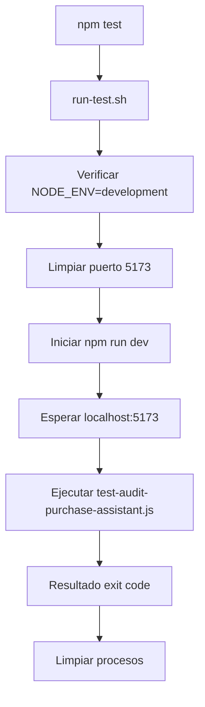

# 🧪 TESTING IMPLEMENTATION
## Guía Técnica para el Sistema de Testing

**Tipo Diátaxis**: INSTRUCCIONES (HOW-TO)  
**Fecha**: 9 de Enero de 2026  
**Versión**: 1.0.0  
**Propósito**: Guía paso-a-paso para implementar, ejecutar y mantener pruebas automatizadas

---

## 📋 Tabla de Contenidos

1. [Visión General](#visión-general)
2. [Arquitectura de Testing](#arquitectura-de-testing)
3. [Configuración del Entorno](#configuración-del-entorno)
4. [Ejecución de Pruebas](#ejecución-de-pruebas)
5. [Escritura de Nuevas Pruebas](#escritura-de-nuevas-pruebas)
6. [Debugging y Troubleshooting](#debugging-y-troubleshooting)
7. [Mejores Prácticas](#mejores-prácticas)
8. [Mantenimiento](#mantenimiento)

---

## 🎯 Visión General

### ¿Por qué Testing Automatizado?

El sistema de testing automatizado garantiza que:

- ✅ **Funcionalidades críticas** funcionan correctamente
- ✅ **Regresiones** se detectan automáticamente
- ✅ **Nuevos desarrolladores** pueden validar cambios
- ✅ **Calidad del código** se mantiene en el tiempo
- ✅ **Documentación ejecutable** existe

### Alcance Actual

- **Playwright E2E**: Testing de interfaz completa
- **Node.js Scripts**: Testing de lógica y formularios
- **Bash Automation**: Orquestación y automatización

---

## 🏗️ Arquitectura de Testing

### Estructura de Archivos

```
📁 tests/                          # Pruebas principales
├── test-audit-purchase-assistant.js    # 🧪 Auditoría completa E2E
├── test-empty-form.js                  # 🧪 Validación de formularios
└── test-purchase-assistant.js          # 🧪 Testing básico

📁 scripts/                        # Automatización
└── run-test.sh                         # 🚀 Orquestador principal

📁 package.json                    # Configuración
└── "scripts": {                   # Scripts npm
    "test": "bash scripts/run-test.sh",
    "test:empty": "node tests/test-empty-form.js",
    "test:menu": "node test-menu.js"
  }
```

### Flujo de Ejecución



---

## ⚙️ Configuración del Entorno

### Requisitos Previos

```bash
# Verificar Node.js y npm
node --version    # Debe ser >= 18
npm --version     # Debe ser >= 9

# Instalar dependencias
npm install

# Verificar dependencias de testing
npm list playwright kill-port wait-on
```

### Variables de Entorno

```bash
# Para testing, debe ser development
NODE_ENV=development

# Puerto de desarrollo (default: 5173)
PORT=5173
```

### Configuración de Playwright

Playwright se instala automáticamente con `npm install`. No requiere configuración adicional para este proyecto.

---

## 🚀 Ejecución de Pruebas

### Comando Principal

```bash
# Ejecuta la auditoría completa automatizada
npm test
```

**Salida esperada**:
```
🔍 Iniciando auditoría del Asistente de Compra...

🌐 Navegando a la aplicación...
🛍️ Abriendo Asistente de Compra...
📝 Probando formulario vacío...
📝 Llenando formulario con datos válidos...
🔢 Calculando viabilidad...
✅ Prueba completada exitosamente
```

### Pruebas Individuales

```bash
# Solo testing de formularios vacíos
npm run test:empty

# Solo testing del menú principal
npm run test:menu
```

### Modos de Ejecución

```bash
# Con output detallado
DEBUG=true npm test

# Solo verificar sin ejecutar (dry-run)
DRY_RUN=true npm test
```

---

## ✍️ Escritura de Nuevas Pruebas

### Plantilla para Pruebas Playwright

```javascript
import { chromium } from 'playwright';

async function testMiFeature() {
  console.log('🔍 Iniciando prueba de Mi Feature...\n');

  const browser = await chromium.launch();
  const page = await browser.newPage();

  // Capturar errores
  page.on('console', msg => {
    if (msg.type() === 'error') {
      console.log('❌ Error en consola:', msg.text());
    }
  });
  page.on('pageerror', error => console.log('💥 Error de página:', error.message));

  try {
    // 1. Navegar a la app
    console.log('🌐 Navegando a la aplicación...');
    await page.goto('http://localhost:5173', { waitUntil: 'networkidle', timeout: 30000 });

    // 2. Interactuar con la UI
    console.log('🎯 Ejecutando pruebas...');
    // ... tu lógica de testing aquí ...

    // 3. Verificar resultados
    console.log('✅ Prueba completada exitosamente');

  } catch (error) {
    console.error('❌ Error en la prueba:', error.message);
    throw error;
  } finally {
    await browser.close();
  }
}

// Ejecutar si es llamado directamente
if (import.meta.url === `file://${process.argv[1]}`) {
  testMiFeature().catch(console.error);
}

export { testMiFeature };
```

### Plantilla para Pruebas Node.js

```javascript
// test-mi-logica.js
function testMiLogica() {
  console.log('🧪 Probando lógica de Mi Feature...\n');

  // Test cases
  const testCases = [
    { input: 'valor1', expected: 'resultado1' },
    { input: 'valor2', expected: 'resultado2' },
  ];

  let passed = 0;
  let failed = 0;

  testCases.forEach((testCase, index) => {
    try {
      const result = miFuncion(testCase.input);
      if (result === testCase.expected) {
        console.log(`✅ Test ${index + 1}: PASSED`);
        passed++;
      } else {
        console.log(`❌ Test ${index + 1}: FAILED - Expected: ${testCase.expected}, Got: ${result}`);
        failed++;
      }
    } catch (error) {
      console.log(`❌ Test ${index + 1}: ERROR - ${error.message}`);
      failed++;
    }
  });

  console.log(`\n📊 Resultados: ${passed} passed, ${failed} failed`);

  if (failed > 0) {
    process.exit(1);
  }
}

// Ejecutar si es llamado directamente
if (import.meta.url === `file://${process.argv[1]}`) {
  testMiLogica();
}

export { testMiLogica };
```

### Agregar Nueva Prueba al Sistema

1. **Crear el archivo** en `/tests/test-[feature].js`
2. **Implementar la lógica** siguiendo la plantilla
3. **Agregar script npm** en `package.json`:
   ```json
   "test:mi-feature": "node tests/test-mi-feature.js"
   ```
4. **Actualizar documentación**:
   - Agregar a `TESTING_STATUS.md`
   - Actualizar esta guía si es necesario
5. **Probar la integración**:
   ```bash
   npm run test:mi-feature
   ```

---

## 🔍 Debugging y Troubleshooting

### Problemas Comunes

#### ❌ "La app no carga en testing"

```bash
# Verificar manualmente
curl -I http://localhost:5173

# Ver logs del servidor
npm run dev
# En otra terminal:
npm test
```

#### ❌ "Playwright no encuentra elementos"

```javascript
// Agregar esperas explícitas
await page.waitForSelector('.mi-selector', { timeout: 10000 });

// Verificar selector
const element = await page.locator('.mi-selector');
console.log('Elementos encontrados:', await element.count());
```

#### ❌ "Timeout en pruebas"

```javascript
// Aumentar timeouts
await page.goto('http://localhost:5173', { timeout: 60000 });
await page.waitForSelector('.elemento', { timeout: 15000 });
```

#### ❌ "Errores de consola no se capturan"

```javascript
// Mejor captura de errores
page.on('console', msg => {
  const type = msg.type();
  const text = msg.text();
  console.log(`[${type.toUpperCase()}] ${text}`);
});
```

### Herramientas de Debug

```bash
# Ejecutar con modo debug
DEBUG=pw:api npm test

# Ver screenshot en caso de error
await page.screenshot({ path: 'error.png' });

# Ver HTML de la página
const html = await page.content();
console.log(html);
```

---

## 🌟 Mejores Prácticas

### Estructura de Pruebas

```javascript
describe('Mi Feature', () => {
  let browser, page;

  beforeAll(async () => {
    browser = await chromium.launch();
    page = await browser.newPage();
  });

  afterAll(async () => {
    await browser.close();
  });

  beforeEach(async () => {
    await page.goto('http://localhost:5173');
  });

  test('debe hacer algo específico', async () => {
    // Arrange
    // Act
    // Assert
  });
});
```

### Selectores Robustos

```javascript
// ❌ Evitar: selectores frágiles
await page.click('.btn-primary');

// ✅ Preferir: selectores semánticos
await page.click('button:has-text("Guardar")');
await page.click('[aria-label="Abrir menú"]');
await page.click('#unique-id');
```

### Manejo de Datos de Prueba

```javascript
// Usar datos realistas
const testData = {
  producto: 'iPhone 15 Pro',
  precio: 50000,
  categoria: 'electronica',
  metodoPago: 'cuotas',
  plazo: 24
};
```

### Assertions Claras

```javascript
// ✅ Bueno: assertion descriptiva
expect(await page.locator('.error-message').count()).toBeGreaterThan(0);

// ❌ Malo: assertion vaga
expect(await page.textContent('body')).toContain('error');
```

---

## 🔧 Mantenimiento

### Actualización de Dependencias

```bash
# Verificar updates
npm outdated playwright

# Actualizar
npm update playwright

# Probar después de update
npm test
```

### Limpieza de Pruebas

```bash
# Ejecutar regularmente
npm test

# Limpiar screenshots antiguos
find tests/ -name "*.png" -type f -mtime +7 -delete
```

### Monitoreo de Cobertura

- Revisar `TESTING_STATUS.md` regularmente
- Actualizar métricas de cobertura
- Identificar áreas sin testing

### CI/CD Integration (Futuro)

```yaml
# .github/workflows/test.yml
name: Testing
on: [push, pull_request]
jobs:
  test:
    runs-on: ubuntu-latest
    steps:
      - uses: actions/checkout@v3
      - uses: actions/setup-node@v3
      - run: npm install
      - run: npm test
```

---

## 📚 Referencias

- [Playwright Documentation](https://playwright.dev/docs/intro)
- [Testing con React](https://react.dev/learn/testing-your-ui)
- [JavaScript Testing Best Practices](https://github.com/goldbergyoni/javascript-testing-best-practices)
- [E2E Testing Guide](https://martinfowler.com/articles/practical-test-pyramid.html)

---

## 🎯 Checklist para Nuevas Pruebas

- [ ] Archivo creado en `/tests/test-[feature].js`
- [ ] Lógica implementada siguiendo plantilla
- [ ] Script npm agregado en `package.json`
- [ ] Documentación actualizada en `TESTING_STATUS.md`
- [ ] Prueba ejecutada exitosamente
- [ ] Código revisado por otro desarrollador
- [ ] Cobertura de edge cases considerada

---

**Estado**: ✅ Implementado y documentado  
**Última actualización**: 9 de enero de 2026  
**Próxima revisión**: Al agregar nuevas funcionalidades de testing